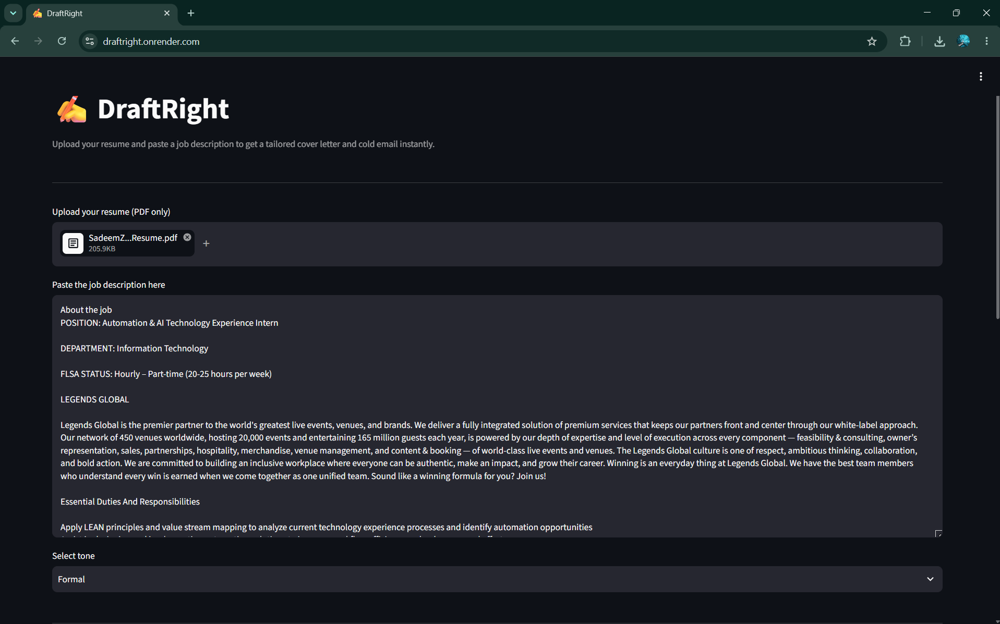
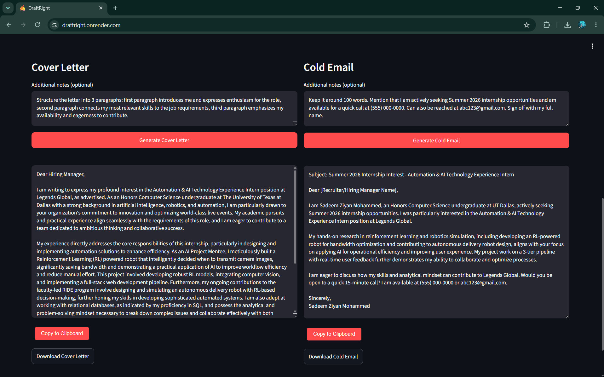

# ✍️ DraftRight - AI Cover Letter & Cold Email Generator

A web app that generates tailored cover letters and cold outreach emails from your resume and a job description, powered by Google Gemini.

**[Live Demo →](https://draftright.onrender.com)**

---

## What it does

Upload your resume as a PDF, paste a job description and pick a tone to get a personalized cover letter and cold email in seconds.

- Extracts text from your resume PDF automatically
- Sends your resume + job description + any additional notes from user to Google Gemini (gemini-2.5-flash)
- Returns a tailored cover letter (3–4 paragraphs) and a cold email (under 150 words)
- Three tone options: formal, conversational, confident
- Copy the generated content to your clipboard or download it as a text file

---

## Tech Stack

| Layer      | Technology                                  |
|------------|---------------------------------------------|
| Frontend   | Streamlit                                   |
| Backend    | FastAPI + Uvicorn                           |
| PDF Parsing| pdfplumber                                  |
| LLM        | Google Gemini API (`gemini-2.5-flash`) |
| Deployment | Render                                      |

--- 

## Screenshots




---

## Run it locally

**Prerequisites:** Python 3.11+, a Google Gemini API key (free at [aistudio.google.com](https://aistudio.google.com))

```bash
# Clone the repo
git clone https://github.com/sadeemziyan/DraftRight.git
cd DraftRight

# Create and activate virtual environment
python3 -m venv .venv
source .venv/bin/activate

# Install dependencies
pip install -r requirements.txt

# Add your API key
echo "GEMINI_API_KEY=your_key_here" > .env

# Terminal 1: start the backend
uvicorn backend.main:app --reload --port 8000

# Terminal 2: start the frontend
streamlit run frontend/app.py
```

Then open `http://localhost:8501` in your browser.

---

## Project structure

```
DraftRight/
├── backend/
│   ├── main.py        # FastAPI routes
│   ├── llm.py         # Gemini API calls and prompt logic
│   └── parser.py      # PDF text extraction
├── frontend/
│   └── app.py         # Streamlit UI
├── .env               # API key (not committed)
├── .env.example       # template for required environment variables
└── requirements.txt
```

---

## Notes

- The app is hosted on Render's free tier. If it hasn't been visited in a while, the first load may take ~30 seconds while the server wakes up.
- The Gemini free tier allows 20 requests per day, which is more than enough for personal use.

---

*Built by [Sadeem Ziyan](https://github.com/sadeemziyan) - CS freshman at UT Dallas*